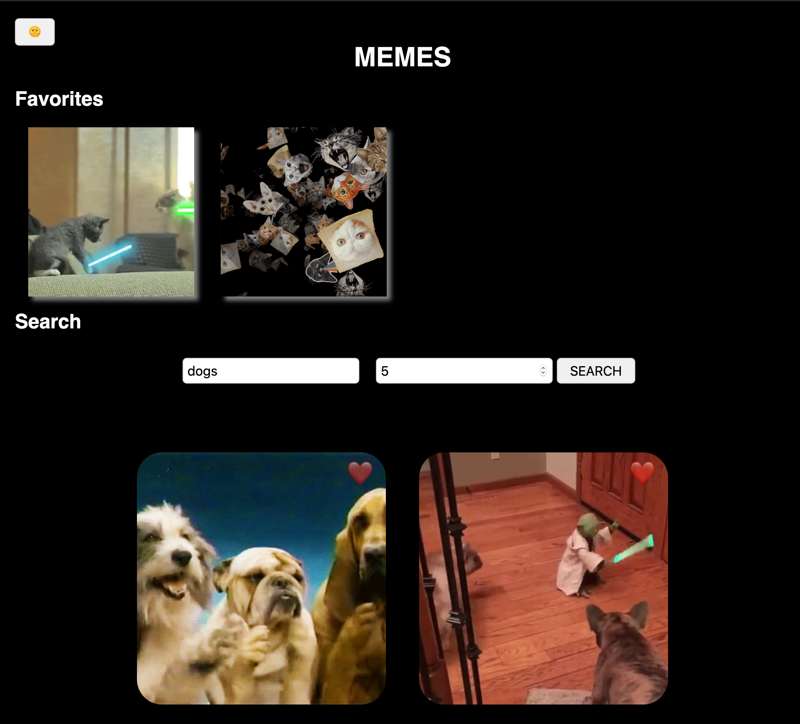

# meme-app



## Live demo:

http://meme-app.surge.sh/

## dev
```bash
$ npm install
$ npm run dev
```

Parcel hot-reload dev server starts at
localhost:1234

## build
```bash
$ npm run build
```

Parcel builds to `dist/`

# Options:

Modify the npm scripts to customize dev and build options:

### DEV

default: `parcel index.html`

customize: `parcel <ENTRY_POINT> --port <YOUR_PORT_NUMBER>`

### BUILD

default: `parcel build index.html`

customize: `parcel build <ENTRY_POINT> --d <YOUR_BUILD_DIR>`